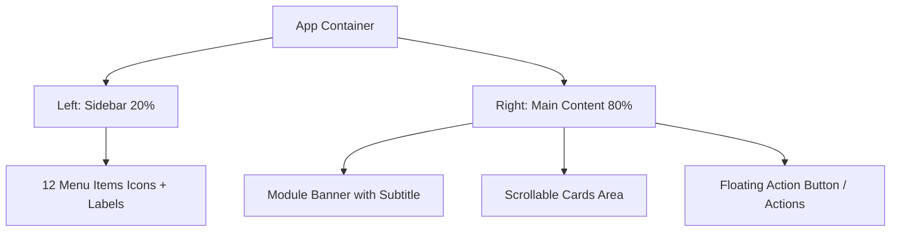

# 全局搭建规则与设计规范系统 (App Global Build Rules & Design System)

根据对这 11 张 WEBP 截图的逐一深度分析，本规范提炼了一套统一的**视觉风格（Visual Style）**、**交互逻辑（Interaction Logic）**和**页面结构（Page Structure）**，旨在指导前端与客户端开发，实现高度一致、质感 premium 且易于维护的代码底座。

---

## 一、 全局视觉风格与设计系统 (Global Visual Style)

应用采用了一种温暖、舒适、疗愈的**现代马卡龙/日系轻量化设计风格**。

### 1. 全局色彩系统 (Color Palette)

应用没有使用刺眼的纯色，而是采用了低饱和度、高明度的色彩，营造出轻松无压力的氛围。

*   **全局底色 (App Background):** `#F4F3EB` (一种带有微黄暖意的米白，降低眼部疲劳)
*   **侧边栏背景 (Sidebar Background):** `#EDECE3` (略深于底色的米黄，形成清晰的左右视觉层次)
*   **侧边栏激活色 (Sidebar Active):** `#1A1A1A` (纯黑或极深灰，圆角填充，文字/图标反白)
*   **卡片底色 (Card Background):** `#FFFFFF` (纯白，提供强烈的视差与内容聚合感)
*   **卡片阴影 (Card Shadow):** `box-shadow: 0 8px 24px rgba(0, 0, 0, 0.02), 0 2px 8px rgba(0, 0, 0, 0.01)` (极其柔和的无感投影)
*   **卡片圆角 (Card Border Radius):** `20px` (大圆角设计，体现柔和的亲和力)
*   **文字颜色 (Typography Color):**
    *   主要内容/标题：`#1D1D1F` (深炭黑)
    *   次要信息/辅助文本：`#8E8E93` 或 `#A1A1A6` (中灰)
    *   边框与分割线：`#E5E5EA` (浅灰)

### 2. 模块主题色系统 (Accent Colors & Theme Config)
每个功能模块通过注入特定的主题色，来保持个性并提升辨识度。

| 模块名称 | 主题色名称 | 强调色 (Accent) | 横幅/标签背景色 (Light Bg) | 视觉感官 |
| :--- | :--- | :--- | :--- | :--- |
| **每日灵感** | 灵感粉 | `#E5485E` | `#FDE8E9` | 热情、创意爆发 |
| **英语口语练习** | 口语蓝 | `#2F80ED` | `#E8F2FD` | 专业、冷静、条理 |
| **每日减脂饮食** | 减脂绿 | `#27AE60` | `#E8FDF3` | 健康、自然、有机 |
| **运动塑形锻炼** | 运动紫 | `#7B61FF` | `#EBE8FD` | 活力、跃动、坚持 |
| **热点新闻** | 时政黄 | `#D4A373` | `#FDF5E8` | 沉稳、深度、资讯感 |
| **成长书籍推荐** | 书籍粉 | `#D81B60` | `#FDE8E9` | 知性、优雅、内敛 |
| **赚钱信息差** | 财富绿/蓝 | `#2ECC71` 或 `#2196F3` | `#E8FDF3` | 财富、敏锐、机遇 |
| **修心修行功课** | 静心紫 | `#9B5DE5` | `#EBE8FD` | 神秘、平和、秩序 |
| **博客精选** | 暖阳黄 | `#F1C40F` | `#FDF5E8` | 温馨、生活化、感悟 |
| **养生** | 养生橘/粉 | `#E67E22` | `#FDE8E9` | 温润、关爱、节律 |
| **我的树洞** | 疗愈蓝 | 渐变: `#D4ECFC` $\rightarrow$ `#BAC8FF` | 面板: `#F0F6FF` | 降噪、安全感、宽慰 |

---

## 二、 全局页面布局与交互逻辑 (Layout & Interaction)



### 1. 双栏响应式栅格布局
*   **左侧导航 (Sidebar):** 宽度占比约为 `20%` (或固定 `180px - 220px`)。
    *   **排版:** 纵向排列。每个子项（Item）呈正方形或高矩形。
    *   **子项样式:** 上面是图标 (Icon)，下面是小字 (Label)。
    *   **高亮状态:** 填充 `#1A1A1A` 黑色背景，圆角为 `12px`，图标和文字设为纯白。非高亮状态下为淡米黄底色，图标和文字为深灰。
*   **右侧内容区 (Main Content):** 宽度占比约为 `80%`，带 `24px` 的内边距 (`padding`)。
    *   **滚动机制:** 仅右侧内容区独立纵向滚动 (`overflow-y: auto`)，左侧侧边栏固定。

### 2. 核心组件交互规范
*   **横幅横幅组件 (Module Banner):**
    *   位于右侧内容区顶部，宽度 `100%`，高度 `80px - 90px`，圆角 `16px`。
    *   背景使用该模块对应的 Theme Light Bg，左侧显示主标题 (font-weight: bold, font-size: 20px) 和副标题 (font-size: 14px, color: 强调色/深灰)。
*   **分类页签 (Pill Tabs):**
    *   用于分类筛选（如“全部”、“生活”、“工作”）。
    *   使用药丸状圆角背景 (`border-radius: 20px`)。
    *   激活时：填充模块的主题强调色 (Accent Color)，文字为白色。
    *   未激活时：背景为白底或极淡灰，文字为灰色。
*   **卡片内操作按钮 (Card Inline Actions):**
    *   置顶/编辑/删除等操作：按钮呈小药丸状，底色为超轻马卡龙色。例如：
        *   置顶：背景 `#FEF9E7`，文字 `#F1C40F` (黄色系)
        *   编辑：背景 `#EBF5FB`，文字 `#2980B9` (蓝色系)
        *   删除：背景 `#FDEDEC`，文字 `#C0392B` (红色系)
    *   大头针图标 📌 代表置顶状态。
*   **悬浮操作按钮 (FAB - Floating Action Button):**
    *   固定在右下角（如“+ 新增”、“+ 新增饮食”、“🗑️ 清空”）。
    *   采用柔和半透明浅粉/浅紫色药丸背景，高度 `44px`，带 `+` 符号，悬浮感强，圆角 `22px`。

---

## 三、 11 个模块结构分析与 Schema 设计

### 1. 每日灵感 (Daily Inspiration)
*   **页面结构:** 顶部 Banner $\rightarrow$ 语音/文本快捷输入框 $\rightarrow$ 分类 Tabs (全部/创意/生活/工作/学习) $\rightarrow$ 灵感列表 (包含卡片操作区、文本内容、发布时间) $\rightarrow$ 右下角新增悬浮按钮。
*   **关键数据 Schema:**
    ```typescript
    interface Inspiration {
      id: string;
      category: 'creativity' | 'life' | 'work' | 'study';
      content: string;
      createdAt: Date;
      isPinned: boolean;
    }
    ```

### 2. 英语口语练习 (English Speaking)
*   **页面结构:** 顶部 Banner $\rightarrow$ 每日金句卡片（英文、中文、跟读按钮） $\rightarrow$ 初级英语短句列表（带喇叭播放按钮） $\rightarrow$ 学习视频卡片列表（横向或网格布局，带圆心播放 icon）。
*   **交互逻辑:** 点击短句整行或喇叭 icon 触发 TTS/语音播放；点击跟读按钮开启录音评测。

### 3. 每日减脂饮食 (Diet Tracker)
*   **页面结构:** 顶部圆环卡路里仪表盘（已摄入/目标值，以及蛋白质/碳水/脂肪剩余情况） $\rightarrow$ 三餐卡片列表（早餐/午餐/晚餐，每餐右侧有“+ 添加”按钮） $\rightarrow$ 减脂食谱推荐（带火苗 🔥 卡路里标签） $\rightarrow$ 右下角“+ 新增饮食”按钮。

### 4. 运动塑形锻炼 (Workout Planner)
*   **页面结构:** 顶部 Banner $\rightarrow$ 运动日历（本月已打卡天数，日历格内已打卡日期呈蓝色圆圈激活态） $\rightarrow$ 倒计时计时器（圆形 SVG 进度条展示 30:00，下方是“开始锻炼”和“重置”按钮） $\rightarrow$ 锻炼分类 Tabs (有氧/力量/拉伸) $\rightarrow$ 视频课程卡片列表。

### 5. 热点新闻 (Hot News)
*   **页面结构:** 顶部 Banner $\rightarrow$ 新闻分类 Tabs (全部/时政/财经/科技/娱乐) $\rightarrow$ 新闻列表卡片（带收藏空心五角星 ⭐、分类来源标签、粗体标题、简述、时间、右侧 `查看详情 ->` 链接）。

### 6. 成长书籍推荐 (Book Recommendation)
*   **页面结构:** 顶部 Banner $\rightarrow$ “本月推荐”黄金卡片（3D书封、书名、作者与分类标签、简评） $\rightarrow$ 书单列表（分月份聚合，如“7月书单”、“8月书单”，每本书右侧配有一条简易水平阅读进度条）。

### 7. 赚钱信息差 (Arbitrage Info)
*   **页面结构:** 顶部 Banner $\rightarrow$ 分类 Tabs (全部/副业/兼职/投资/创业) $\rightarrow$ 信息差列表卡片（同新闻卡片布局，强化副业和兼职的具体落地实操指南）。

### 8. 修心修行功课 (Mindfulness Practice)
*   **页面结构:** 顶部 Banner $\rightarrow$ 今日功课打卡列表（冥想、抄经、反思、感恩，每行右侧为“打卡”状态按钮） $\rightarrow$ 功课记录日历（打卡率统计，以月历展示） $\rightarrow$ 底部意境语录卡片（带“分享语录”按钮）。

### 9. 博客精选 (Blog Selection)
*   **页面结构:** 顶部 Banner $\rightarrow$ 分类 Tabs (全部/生活/职场/情感/成长) $\rightarrow$ 博客列表卡片（包含粗体标题、作者高亮 `@林小溪 · life`、摘要、发布时间、右侧 `阅读全文 ->`）。

### 10. 养生 (Wellness)
*   **页面结构:** 顶部 Banner $\rightarrow$ 今日养生计划 Checkbox 列表 $\rightarrow$ 养生知识卡片（按春/夏/秋/冬四季划分，带花朵、太阳、枫叶、雪花等节气 Icon） $\rightarrow$ 底部打卡天数汇总。

### 11. 我的树洞 (My Tree Hole)
*   **页面结构:** 顶部蓝色疗愈渐变 Banner（提示词：“在这里，你可以写下任何心事”） $\rightarrow$ 树洞输入区（文本域 + 6 种情绪图标选择：“开心/难过/焦虑/生气/平静/疲惫” $\rightarrow$ “投递到树洞”大按钮） $\rightarrow$ 树洞回信卡片（树洞精灵温柔回信） $\rightarrow$ 历史心事记录（带情绪 Tag 和删除键） $\rightarrow$ 悬浮“清空”按钮。

---

## 四、 💡 前瞻性技术方案与搭建建议 (Developer Recommendations)

为了完美落地上述设计并实现极高的可维护性，建议在代码架构层面采用以下方案：

### 1. 动态 CSS 变量主题切换 (Dynamic CSS Theme Variables)
不要为 11 个模块写 11 套样式，而是采用一个全局 `ThemeProvider`，基于当前激活的侧边栏菜单，在根节点挂载不同的 CSS Variables。
```css
/* 例：每日灵感激活时的 CSS 变量 */
[data-theme="inspiration"] {
  --theme-accent: #E5485E;
  --theme-light-bg: #FDE8E9;
  --theme-hover-accent: #D03D52;
}

/* 例：英语口语激活时的 CSS 变量 */
[data-theme="english"] {
  --theme-accent: #2F80ED;
  --theme-light-bg: #E8F2FD;
  --theme-hover-accent: #1B6FD1;
}

/* 全局组件复用 */
.module-banner {
  background-color: var(--theme-light-bg);
  border-left: 4px solid var(--theme-accent);
}
.pill-tab.active {
  background-color: var(--theme-accent);
  color: #fff;
}
```

### 2. 通用日历打卡组件 (Universal Checkin Calendar)
“运动塑形锻炼”和“修心修行功课”两个模块均用到了打卡日历。应封装一个通用的 `CheckinCalendar` 组件：
*   **Props 传入:**
    *   `checkedDays: string[]` (例如 `['2026-07-01', '2026-07-03']`)
    *   `activeColor: string` (使用 `--theme-accent`)
    *   `todayBgColor: string` (当天日期的粉底色)

### 3. 数据状态持久化 (Local Persistence)
鉴于包含较多“打卡”、“记录”、“饮食”等需要用户频繁输入的数据，在没有重度后端支持的前期，使用 `localStorage` 或 `IndexedDB` 建立前端本地数据库，结合 `ServiceWorker` 实现离线可用（PWA）。

### 4. 缺失的「理财存钱」模块 UI 补全建议
截图菜单中出现但无详情的“理财存钱”模块，可以按照以下页面结构进行补充搭建：
*   **视觉风格:** 主题色设为 **理财金** (强调色 `#F39C12`，浅背景 `#FEF9E7`)。
*   **页面结构:**
    *   顶部 Banner：“理财存钱，合理规划财富”。
    *   存钱挑战组件：比如“365天存钱法”或“12存单法”的网格进度图（类似运动打卡日历，每个网格代表一笔存款，存入后点亮）。
    *   记账卡片：简单的“收入/支出”快捷录入，展示本月存钱进度条。
